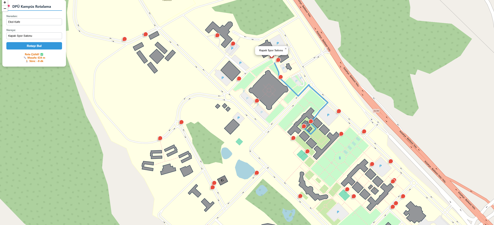

# DPÜ Kampüs İçi Rotalama ve Ağ Optimizasyonu

Bu proje, Kütahya Dumlupınar Üniversitesi (DPÜ) kampüsü içindeki fiziksel konumları birer ağ düğümü (node) ve bağlantı yollarını veri iletim hattı (edge) olarak modelleyen Web tabanlı bir Coğrafi Bilgi Sistemi (WebGIS) uygulamasıdır.

Projenin temel amacı; gerçek harita koordinatları üzerinden alınan fiziksel saha verilerini dijital bir ağ topolojisine dönüştürmek ve iki nokta arasındaki en uygun güzergâhı **Dijkstra Algoritması** kullanarak optimize etmektir.

---

## 🎓 Proje Hakkında

Bu proje, **Bursa Büyükşehir Belediyesi Trafik Şube Müdürlüğü**'nde tamamladığım donanım stajı sürecinde geliştirilmiştir. Staj boyunca Trafik Yönetim Merkezi (TYM) bünyesinde akıllı kavşakların merkezle haberleşme altyapısını, fiber optik hatları ve ağ cihazlarının çalışma prensiplerini sahada inceleme fırsatı buldum. Edindiğim bu teknik bilgiyi uygulamalı bir modellemeyle desteklemek amacıyla QGIS ile gerçek harita verileri üzerinde rota analizi gerçekleştirdim ve bu projeyi geliştirdim.

---

## 🔗 Canlı Demo

**[https://dpu-rotam.onrender.com/](https://dpu-rotam.onrender.com/)**

> ⏳ **Not:** Uygulama ücretsiz bir sunucuda barındırılıyor. Siteye birkaç dakika boyunca hiç girilmezse sunucu "uyku moduna" geçer. Bu durumda linke ilk tıkladığınızda sayfanın açılması **20-30 saniye** sürebilir (sunucu "uyanıyor"). Bu normal bir durumdur, sayfa yenilenmeden bekleyin. Sunucu uyandıktan sonra site normal hızda çalışır.



---

## 🚀 Kullanılan Teknolojiler

Bu sistem, donanım haberleşmesi ve ağ mantığının yazılım dünyasındaki karşılığını simüle etmek amacıyla aşağıdaki teknolojilerle geliştirilmiştir:

- **Backend:** Python, Flask, Flask-CORS
- **Graf ve Rota Hesaplama:** NetworkX (Dijkstra Algoritması)
- **Coğrafi Veri İşleme:** GeoPandas
- **Frontend ve Harita Arayüzü:** HTML/CSS/JS, Leaflet.js
- **Coğrafi Veri Kaynağı (CBS):** QGIS, JOSM, GeoJSON
- **Barındırma (Hosting):** Render.com

---

## ⚙️ Sistem Mimarisi ve Çalışma Mantığı

Proje, sadece bir harita üzerinde çizgi çekmekten ziyade, donanımsal bir ağ mimarisinin yazılımla modellenmesi prensibine dayanır:

1. **Veri Toplama ve Düğüm (Node) Modellemesi:** Kampüs içerisindeki yollar ve önemli konumlar QGIS ve JOSM gibi CBS araçları kullanılarak vektörel verilere dönüştürülmüştür. Her bir lokasyon sistemde bir "düğüm", aralarındaki yollar ise fiziksel bir bağlantı (edge) olarak tanımlanmıştır.
2. **Arka Plan (Backend) Haberleşmesi:** Flask tabanlı sunucu, haritadan (istemciden) gelen başlangıç ve bitiş koordinatlarını REST mimarisiyle alır.
3. **Rota Optimizasyonu:** Sunucu tarafında çalışan NetworkX kütüphanesi, gelen konum verilerini graf modellemesi üzerinde işler. Düğümler arası en kısa mesafe Dijkstra algoritması ile hesaplanır.
4. **Görselleştirme:** Hesaplanan en uygun rota, JSON formatında tekrar Leaflet.js arayüzüne iletilir ve kullanıcıya harita üzerinde kesintisiz bir çizgi (güzergâh) olarak gösterilir.

---

## 📁 Proje Yapısı

```
dpu_rotalama/
├── static/
│   ├── data/
│   │   └── kampus_yollar.geojson   # Kampüs yol ağı verisi
│   └── ...                          # CSS, JS ve diğer statik dosyalar
├── templates/
│   └── index.html                   # Leaflet.js harita arayüzü
├── requirements.txt                  # Python bağımlılıkları
└── main.py                          # Flask sunucusu ve rota hesaplama API'si
```

---

## 💡 Kullanım

1. Harita üzerinde bir **başlangıç noktası** seçin.
2. Ardından bir **bitiş noktası** seçin.
3. Sistem, `/api/rota` uç noktası üzerinden Dijkstra algoritmasıyla en kısa güzergâhı hesaplar ve harita üzerinde çizer.

---

## 🔌 API

**POST** `/api/rota`

**İstek gövdesi:**

```
{
  "baslangic": [enlem, boylam],
  "bitis": [enlem, boylam]
}
```

**Başarılı yanıt:**

```
{
  "durum": "basarili",
  "koordinatlar": [[x1, y1], [x2, y2], "..."]
}
```

---

## 🛠️ Yerel Ortamda Çalıştırma (Opsiyonel)

> Uygulama artık yukarıdaki canlı linkte çalışıyor, aşağıdaki adımlar sadece kendi bilgisayarınızda geliştirme yapmak isteyenler içindir.

### 1. Gereksinimler

- Python 3.8 veya üzeri
- pip

### 2. Repoyu Klonlayın

```
git clone https://github.com/anilaglarin/dpu_rotalama.git
cd dpu_rotalama
```

### 3. Sanal Ortam Oluşturun (Önerilir)

```
python -m venv venv
```

Sanal ortamı etkinleştirin:

**Windows:**
```
venv\Scripts\activate
```

**macOS / Linux:**
```
source venv/bin/activate
```

### 4. Gerekli Kütüphaneleri Yükleyin

```
pip install -r requirements.txt
```

> 💡 `geopandas` kurulumu bazı sistemlerde ek bağımlılıklar (GDAL, Fiona vb.) gerektirebilir. Kurulumda sorun yaşarsanız `conda install geopandas` kullanmanız önerilir.

### 5. Uygulamayı Başlatın

```
python main.py
```

Sunucu başarıyla başladığında terminalde aşağıdaki gibi bir çıktı görürsünüz:

```
🚀 API Sunucusu Çalışıyor! http://127.0.0.1:5000
```

### 6. Uygulamaya Erişin

Tarayıcınızdan aşağıdaki adrese giderek harita arayüzünü açabilirsiniz:

```
http://127.0.0.1:5000
```
---
© Telif Hakkı

Tüm hakları saklıdır.

Bu proje ve kaynak kodları @anilaglarin tarafından geliştirilmiştir. Açık bir lisans belirtilmediği sürece, kodun kopyalanması, dağıtılması veya ticari/kişisel projelerde izinsiz kullanılması yasaktır. Kullanım izni için lütfen iletişime geçin.
---
